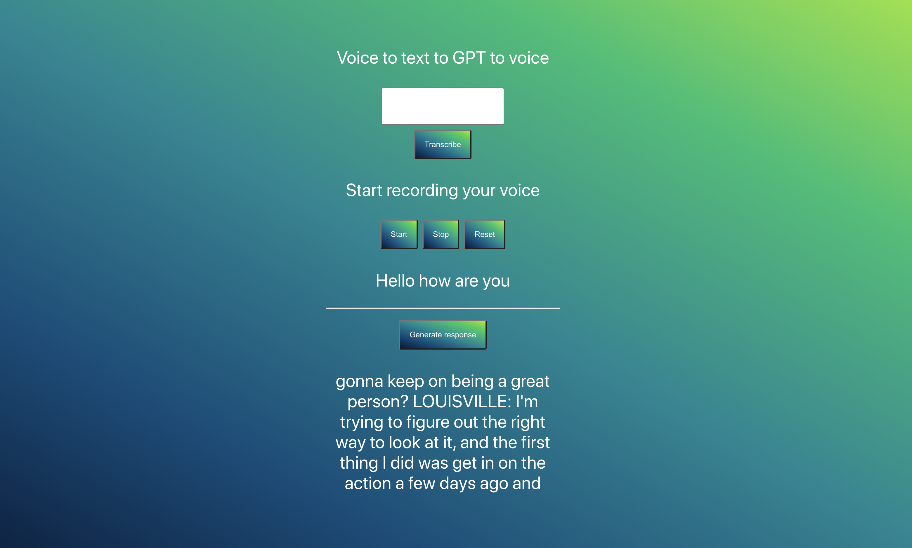

# speech

## Speech APIs for real time voice analysis.
This is an experiment in combining, speech to text with tex to speech and language generation.

You are super welcome to help out. <3

## How to run
After cloning the repo you need the react server, python server and text-to-speech docker server to all be running.
Follow the steps for each to get it working on your machine.

## React web app
```bash
npm install
npm start
```

### React web app fix
export NODE_OPTIONS=--openssl-legacy-provider

## Python GPT2 server
```bash
cd python
bash run_local.sh
```
This spins up a local server running GPT2 hosted on FastApi.

## Text to speech docker
https://github.com/synesthesiam/docker-mozillatts

```
docker run -it -p 5002:5002 synesthesiam/mozillatts
```


## Speech to text web
https://www.npmjs.com/package/react-speech-recognition

```js
import React from 'react'
import SpeechRecognition, { useSpeechRecognition } from 'react-speech-recognition'
import { playAudio } from './App.js'

const Dictaphone = () => {
  const { transcript, resetTranscript } = useSpeechRecognition()

  if (!SpeechRecognition.browserSupportsSpeechRecognition()) {
    return null
  }

  return (
    <div>
      <button onClick={SpeechRecognition.startListening}>Start</button>
      <button onClick={SpeechRecognition.stopListening}>Stop</button>
      <button onClick={resetTranscript}>Reset</button>
      <button onClick={() => playAudio(transcript)}>Transcribe</button>
      <p>{transcript}</p>
    </div>
  )
}
export default Dictaphone
````


Running inside react
```js
export async function playAudio(text) {
  var audio = new Audio(`http://localhost:5002/api/tts?text=${encodeURIComponent(text)}`);  
  audio.type = 'audio/wav';

  try {
    await audio.play();
    console.log('Playing...');
  } catch (err) {
    console.log('Failed to play...' + err);
  }
}
```


